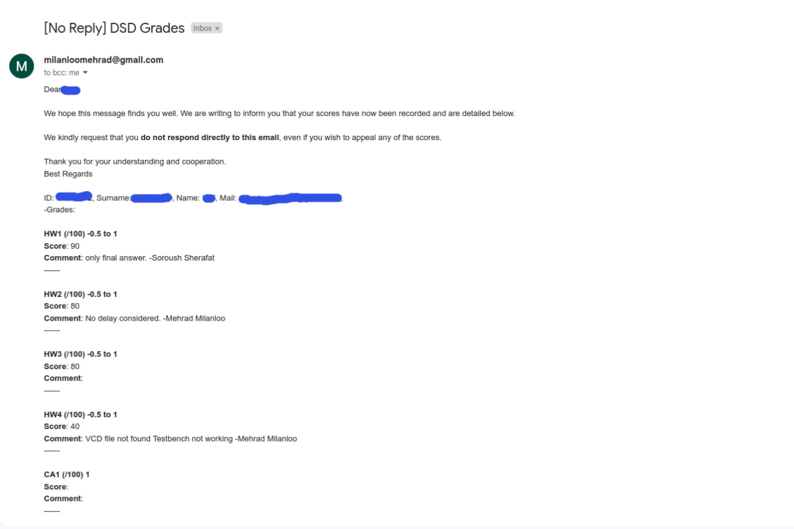

# Grades-Emailer
## Designed for Digital System Design course.
### Spring 2023 - Sharif Universuty of Technology
---
This simple script reads individual student grades from a `.xlsx` file and then sends an email to each student, including their respective scores and any related comments.

(To be improved and generalized)

Simple Output:

